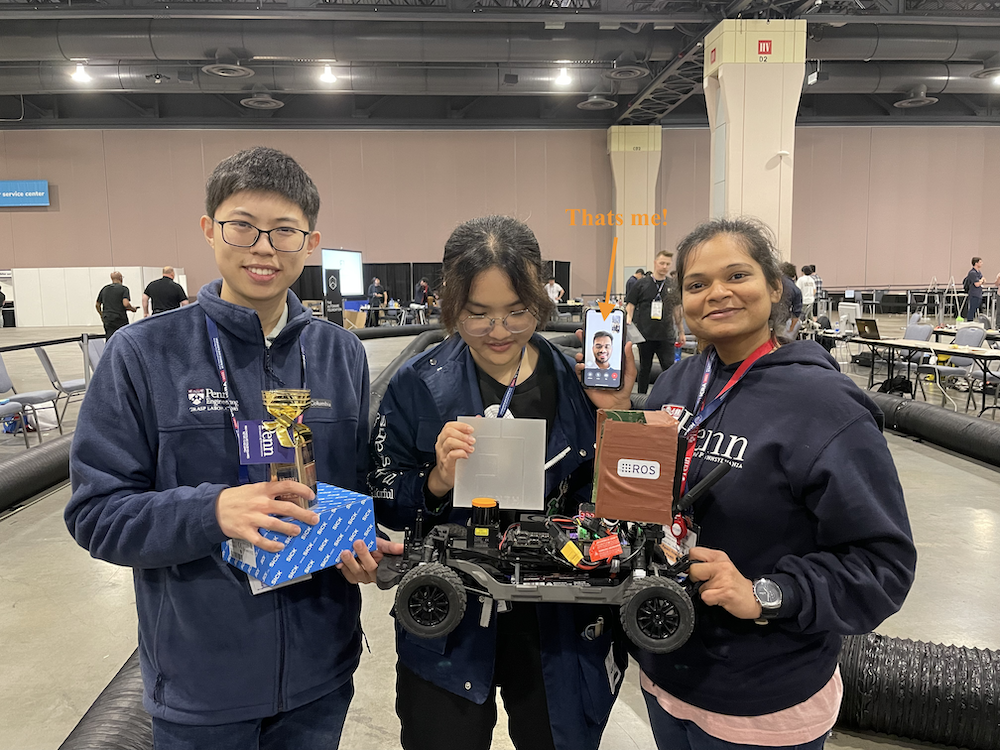

<!-- # Top 3 Things! -->

## 1. Built and Led Beeclust - Multi Robot Systems Lab @ SRM University
I built and led a team of over 30 multidisciplinary undergraduate students to design and develop robots that could print! Our project aimed to revolutionize large-format printing for micro-industries by creating a scalable, modular system. The idea was simple yet powerful—users could scale or accelerate the printing process by adding or removing printer robots as needed.

Along the way, we organized workshops to share knowledge, launched social initiatives, and recruited and trained new team members, ensuring the project continued to grow. We competed in robotics competitions worldwide, winning several of them, and published our research in leading robotics conferences like IROS 2019, SWARM 2021, and ICAR 2019. It was an incredible journey of innovation, teamwork, and impact!

Check it out here: [Instagram](http://instagram.com/beeclust.mrsl/) | [Website](http://beeclust-mrsl.github.io) | [Project](https://karpenet.github.io/sprinter.html) | [Paper 1](https://ieeexplore.ieee.org/document/8981621) | [Paper 2](https://arxiv.org/abs/2102.12026)

The Team!             |  SPRINTER Robot
:-------------------------:|:-------------------------:
  |  

## 2. Won the F1Tenth challenge
My team won the F1Tenth - Autonomous Racing challenge at the International Conference of Robotics and Automation (ICRA) 2022! Led the team of 3 and race strategy for the autonomy stack. 1st place among 38 international teams from leading engineering institutes.

Over the course of a semester, we developed machine learning and perception pipelines, as well as advanced planning and control algorithms, along with other key components of the autonomy stack. We leveraged cutting-edge edge ML and robotics techniques to build a highly efficient and integrated system.

The Team!             |  Our Autonomous Racing Stack on the F1Tenth Platform
:-------------------------:|:-------------------------:
  |  

Check them out here: [Website](https://karpenet.github.io/f1tenth.html) | [Results](https://icra2022-race.f1tenth.org/results.html) | [F1Tenth](https://f1tenth.org)

## 3. Automated Calibration @ Velodyne LiDAR
As part of my summer internship, I deployed Velodyne LiDAR’s first automated calibration process on the production line for calibrating the scanning mirror of the M1600 sensors. I streamlined the existing 89-page Manufacturing Process Instruction (MPI) into a concise, single-page document, reducing the per-unit calibration time by over 50%. Additionally, by automating the process, I significantly improved calibration accuracy, eliminating human error and increasing precision by multiple folds.

Spot visits Velodyne Lidar           |  Our Lidar Testbed
:-------------------------:|:-------------------------:
 | 
