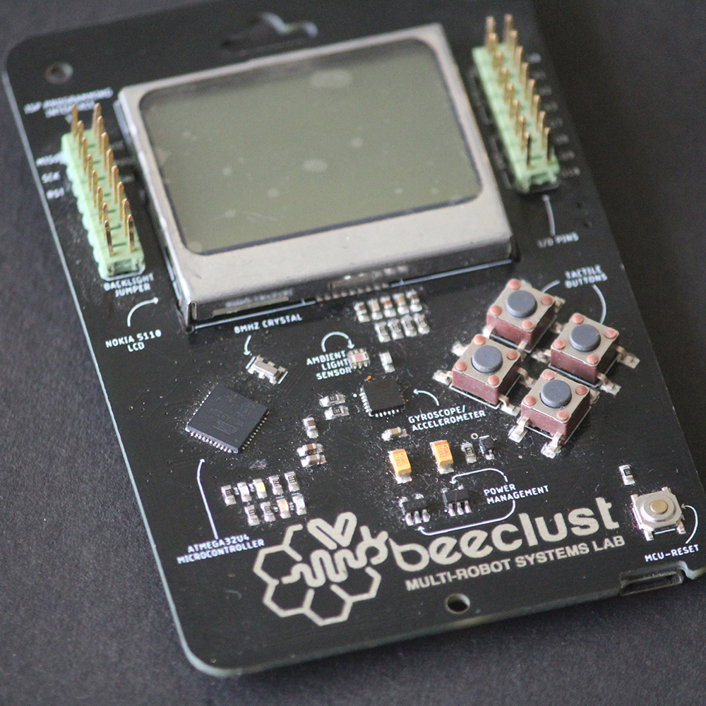
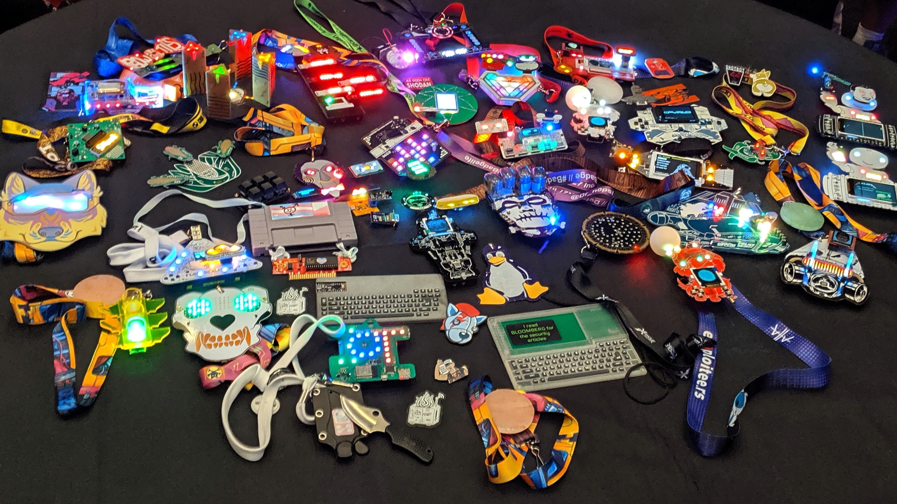
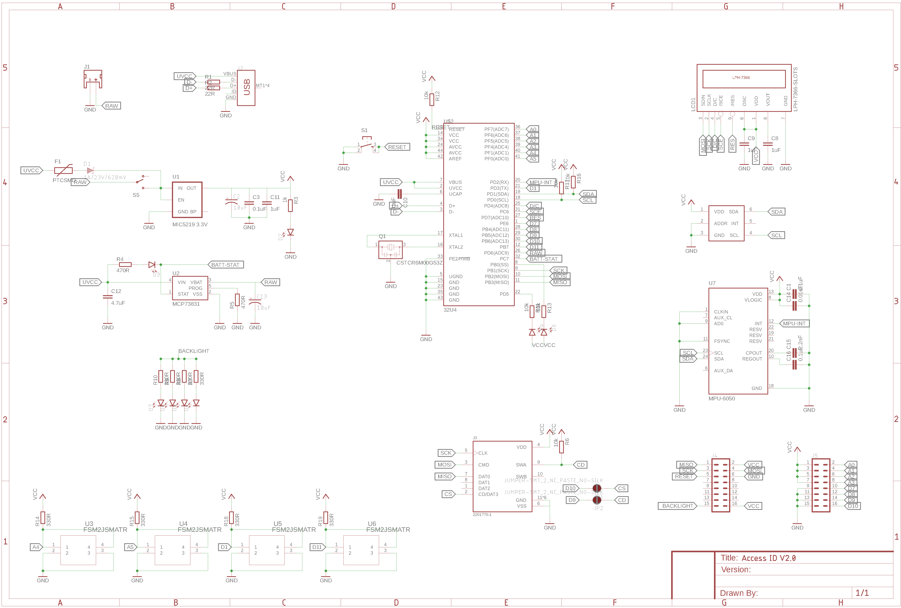

## Introduction
This project was inspired from the revered [DEF CON badges](https://www.defcon.org/html/links/dc-badge.html). The motivation was to build an ID card for the members of [Beeclust Multi-Robot Systems Lab](https://beeclust-mrsl.github.io), which could also double up as an arduino based learning tool for training members of the lab and serve as quick prototyping tool.

  |  
:-------------------------:|:-------------------------:
V2.0 of the PCB ID Card             |  Badges from DEF CON 27

## Schematic

## Design Files
[https://github.com/karpenet/Beeclust-Access-ID](https://github.com/karpenet/Beeclust-Access-ID)