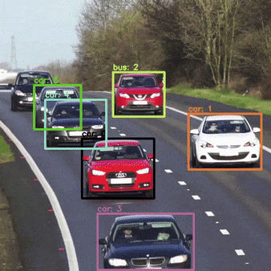

## What is DeepSORT?
DeepSORT (Deep Simple Online and Realtime Tracking) is an advanced multi-object tracking algorithm that builds upon the SORT (Simple Online and Realtime Tracking) algorithm by incorporating deep learning for improved performance. It is designed to track multiple objects in real-time with high accuracy. The key components of DeepSORT are:

1. **Detection**: Object detection is performed using a pre-trained deep learning model, such as YOLO or Faster R-CNN, to identify and locate objects in each frame of a video.

2. **Feature Extraction**: For each detected object, a deep neural network is used to extract appearance features. These features help in distinguishing between different objects and maintaining consistent identities across frames.

3. **Kalman Filter**: A Kalman filter is used to predict the future positions of the tracked objects based on their previous states. This helps in handling occlusions and maintaining smooth trajectories.

4. **Hungarian Algorithm**: The Hungarian algorithm is used to solve the data association problem, matching detected objects with existing tracks based on their appearance features and predicted positions.

5. **Re-identification**: DeepSORT includes a re-identification module that uses the extracted appearance features to re-identify objects that may have been lost due to occlusions or missed detections.

By combining these components, DeepSORT achieves robust and accurate multi-object tracking in real-time applications.

    
    <figcaption>Fig: DeepSORT in action</figcaption>

## How can we Optimize DeepSORT for realtime?

### Level 1: Model Level Optimizations
TensorRT optimizations provide significant performance improvements:
- Graph mode execution
- Fixed input size and batch size for predictable memory consumption
- Targeted hardware optimizations for specific deployment platforms
- Kernel fusion to reduce computational overhead

### Level 2: Kernel Level Optimizations
At the kernel level, two key approaches yield substantial performance gains:

**Block Tiling**  
Partitions data into smaller blocks to optimize memory access and parallel computation, improving cache efficiency and reducing redundant memory accesses.

**Shared Memory**  
Optimizes memory access patterns to improve cache efficiency and minimize redundant operations. The computational complexity is reduced from O(n²) to approximately O(1), where n is the number of unique detections.

GPU acceleration shows significant latency reduction compared to CPU-only processing, maintaining consistent performance even as workload increases.

### Level 3: Process Level Optimizations
**Problem:**  
For dense detections, inference latency drops over time due to increasing cost matrix size as the tracked detections buffer grows.

**Solution:**  
- Implement a fixed-length LRU (Least Recently Used) cache for tracked detections
- Remove stale detections as the buffer reaches capacity
- Prevent the tracked detections buffer from growing unbounded, which stabilizes cost matrix computation

This approach maintains consistent performance over time by controlling the computational complexity of the association step.

Through these multi-level optimizations, DeepSORT can achieve real-time performance even on edge devices while maintaining tracking accuracy.
