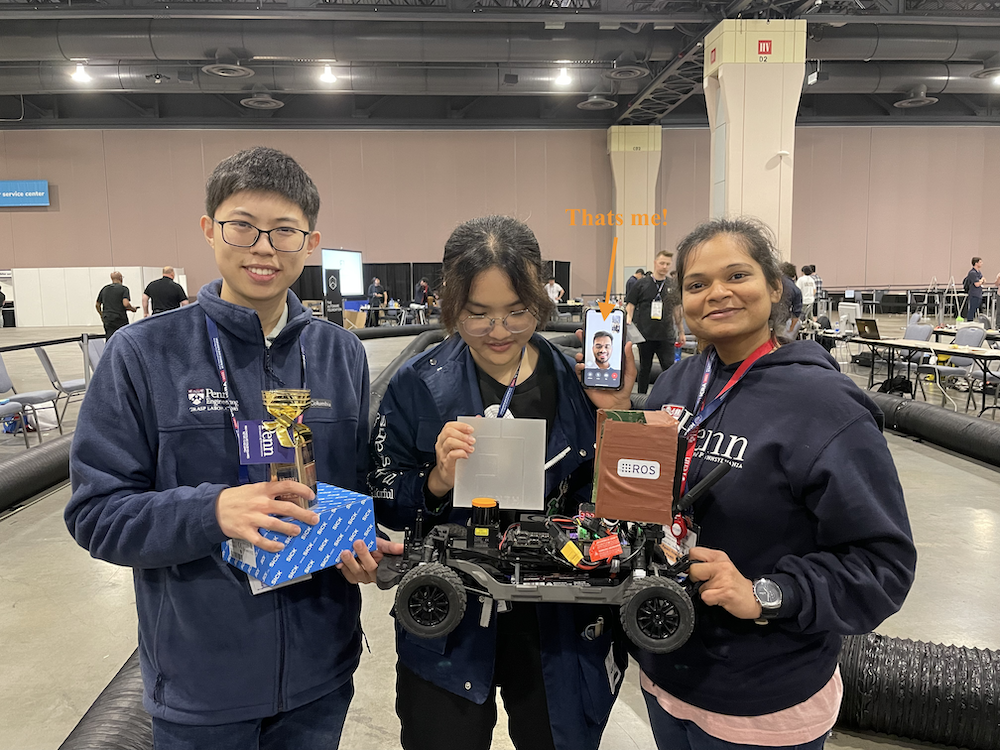

I will be writing about my learnings from and beyond the ESE 615: F1/10 Autonomous Racing course offered in Spring 2022.

## My Team Won at ICRA 2022!!
Little did we know at the beginning of this course that our team will win at the International Conference of Robotics and Automation, Philadelphia - 2022!

Our team beat the teams from the best universities around the world and also the three time champion at F1Tenth. Great job guys!

    
    <figcaption><small>My team at ICRA 2022.</small></figcaption>

# Module I: Reactive Methods

## Wall Following:
<iframe src="https://www.youtube.com/embed/vA0JITsma-I" title="YouTube video player" frameborder="0" allow="accelerometer; autoplay; clipboard-write; encrypted-media; gyroscope; picture-in-picture" allowfullscreen></iframe>

## Disparity Extender:
<iframe src="https://www.youtube.com/embed/Wl7HnYWEY44" title="YouTube video player" frameborder="0" allow="accelerometer; autoplay; clipboard-write; encrypted-media; gyroscope; picture-in-picture" allowfullscreen></iframe>

## Artificial Potential Fields:

## Race 1

### Problem Statement
Loop 2 laps around Levine Hall using a reactive algorithm like wall follow or a follow the gap.

### Approach
We used a combination of artificial potential fields and cubic splines to plan a follow the gap approach to go around the Levine Hall lobby.

### Race Strategy
We quickly realized that the controller response for the straight strech and the corners had to be starkly different, thus we developed a piecewise PID Control algorithm which would switch between two different tuning paramters based on the straight distance from the f1tenth car.

### Code
<li>
    <a href="https://github.com/karpenet/Reactive-Methods-for-Autonomous-Racing" target="_blank">https://github.com/karpenet/Reactive-Methods-for-Autonomous-Racing</a>
</li>

<figure>
    
    <figcaption><small>Best friend gifted me an action cam on my birthday! Finally was able to pull this FPV video off the actual car.</small></figcaption>
</figure>

**WE STOOD 3RD IN THE RACE!**

# Module II: Map Based Methods
# Module III: Race Optimization!

## Race 3

### Problem Statement
Complete fastest 10 laps at Skirkanich Hall Loop whicle racing an opponent's car.

### Approach
We used an MPC based controlled but quickly realised the lack of compute causing the car's action to lag. We quickly switched gears to a simple pure pursuit controller strategy while avoiding opponent using a virtual lane.

### Race Strategy
Tuning Tuning Tuning!
Tuned the best trajectory and controller gains to get maximum momentum approach where the car slowly began to drift at corners and turned without braking.

<figure>
    
    <figcaption><small>Best friend gifted me an action cam on my birthday! Finally was able to pull this FPV video off the actual car.</small></figcaption>
</figure>

**WE STOOD 1ST IN THE RACE!**