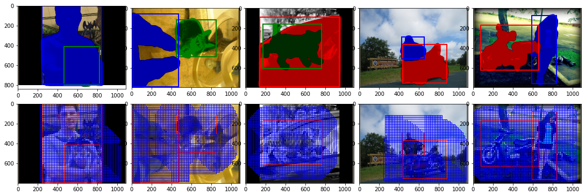
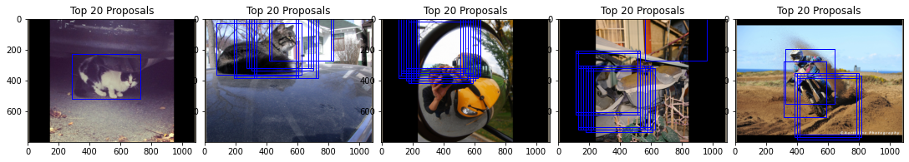
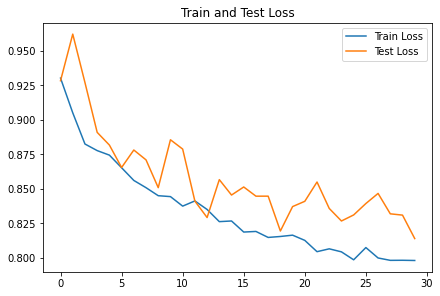
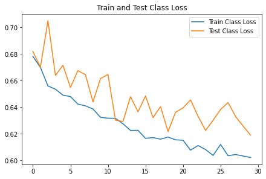
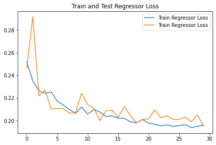
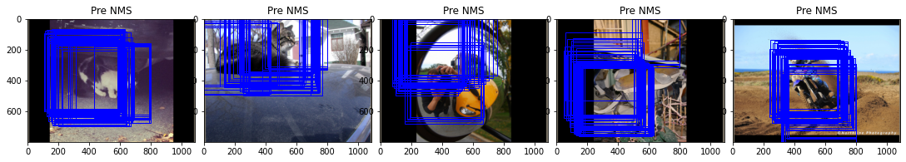
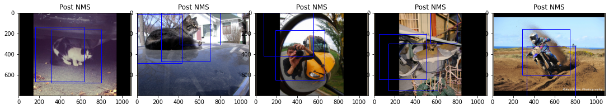

## Github Repository
[https://github.com/kedarkarpe/Faster-RCNN](https://github.com/kedarkarpe/Faster-RCNN)

## Introduction
In this project we will implement some of the components of MaskRCNN, an algorithm that addresses the task of instance segmentation, which combines object detection and semantic segmentation into a per-pixel object detection framework.

The full implementation of Faster-RCNN would take many days to train, so we will implement a simpler version of the Region Proposal Network that keeps all the necessary components. However, these simplifications affect the performance of the algorithm. In the second parts of the project, we will use pretrained parts to boost the performance.

## Model Architecture
The architecture for the RPN and the later refinement of the proposals is shown below:

## Part 1 - Region Proposal Networks
Region Proposal Networks (RPNs) are ”attention mechanisms” for the object detection task, performing a crude but inexpensive first estimation of where the bounding boxes of the objects should be. They were first proposed as a way to address the issue of expensive greedy algorithms like Selective Search, opening new avenues to end-to-end object detection tasks. They work through classifying the initial anchor boxes into object/background and refine the coordinates for the boxes with objects. Later, these boxes will be further refined and tightened by the instance segmentation heads as well as classified in their corresponding classes.

### 1. Ground Truth Creation

### 2. Training and Loss Plots

### 3. Predicted Outputs

## Part 2 - Object Detection
### Classifier Head
The classifier head in Faster-RCNN is responsible for refining the proposals generated by the Region Proposal Network (RPN) and classifying them into specific object categories. It consists of two main components: a bounding box regressor and a classifier.

### 1. Bounding Box Regressor
The bounding box regressor refines the coordinates of the proposals generated by the RPN. It takes the feature maps corresponding to each proposal and predicts the offsets that need to be applied to the proposal coordinates to better fit the object.

### 2. Classifier
The classifier assigns a class label to each proposal. It takes the feature maps corresponding to each proposal and predicts the probability distribution over all possible object classes, including the background class.

### Training
The classifier head is trained using a multi-task loss that combines the classification loss and the bounding box regression loss. The classification loss is typically a cross-entropy loss, while the bounding box regression loss is a smooth L1 loss.

###  Loss Function
The total loss for the classifier head is given by:
$$ L = L_{cls} + \lambda L_{reg} $$
where $$ L_{cls} $$ is the classification loss, $$ L_{reg} $$ is the bounding box regression loss, and $$ \lambda $$ is a weighting factor that balances the two losses.

## References
1. Original YOLO paper: [https://arxiv.org/pdf/1506.02640.pdf](https://arxiv.org/pdf/1506.02640.pdf)
2. Intuitive Explanation: [https://towardsdatascience.com/yolo-you-only-look-once-real-time-object-detection-explained-492dc9230006](https://towardsdatascience.com/yolo-you-only-look-once-real-time-object-detection-explained-492dc9230006)
3. YOLO Video Tutorial: [https://www.youtube.com/watch?v=9s_FpMpdYW8&list=PLkDaE6sCZn6Gl29AoE31iwdVwSG-KnDzF&index=30](https://www.youtube.com/watch?v=9s_FpMpdYW8&list=PLkDaE6sCZn6Gl29AoE31iwdVwSG-KnDzF&index=30)
4. mean Average Precision: [https://medium.com/@jonathan_hui/map-mean-average-precision-for-object-detection-45c121a31173](https://medium.com/@jonathan_hui/map-mean-average-precision-for-object-detection-45c121a31173)
5. Intersection over Union: [https://www.pyimagesearch.com/2016/11/07/intersection-over-union-iou-for-object-detection](https://www.pyimagesearch.com/2016/11/07/intersection-over-union-iou-for-object-detection)