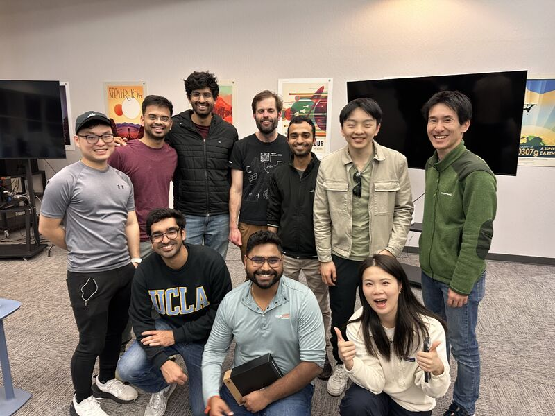

## Project Overview

Can we extend NVIDIA's GR00T N1 to enable bimanual manipulation for SO-100 arms? Check out our cool project that won the Seeed EmbodiedAI Hackathon!

    <iframe class="half-width" frameborder='0' scrolling='no' src='https://www.hackster.io/firebreathing-rubber-duckies/running-lerobot-so-100-arm-on-nvidia-isaac-gr00t-n1-458189/embed' style="height: 400px;"></iframe>
    

  

Find our mention on NVIDIA Robotics Blog [here](https://blogs.nvidia.com/blog/national-robotics-week-2025)!
