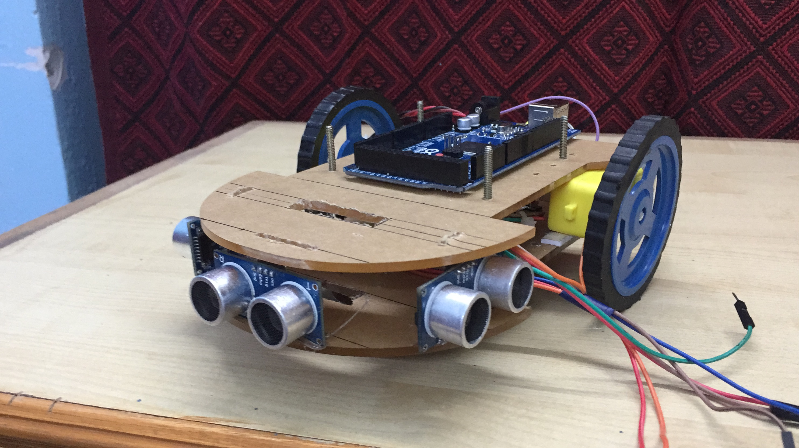

## Github Repository
[https://github.com/karpenet/IARCbot](https://github.com/karpenet/IARCbot)

## Problem Statement
Design a fully autonomous robot to follow a black/white line on a white/black surface and then follow a rigid wall either on the left, right or both sides. While following a line, avoid blue colored obstacles by circumventing them from the left and avoid red colored obstacles by circumventing them from the right.

## Design Parameters
### Compute
- Arduino Mega 2560

### Sensors
- 1x TCRT 5000, 5 Sensor Main Array
- 1x TCRT 5000, 3 Sensor Aux Array
- 3x HC-SR04 Ultrasonic Sensors
- 1x TCS3200 RGB Color Sensor
- 1x MPU6050 6-DOF IMU

### Power
- 3S 2000 mAh Li-Ion Battery
- Custom Power Distribution and User Interface Board

 | 
:-------------------------:|:-------------------------:
Custom lasered acrylic chassis of the IARCbot | Fully assembled robot

 |
:-------------------------:|:-------------------------:
*IARCbot in action at Techkriti 2018, IIT Kanpur* |

