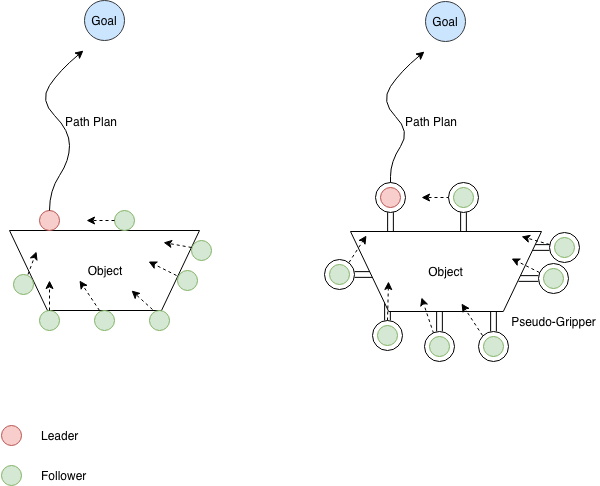
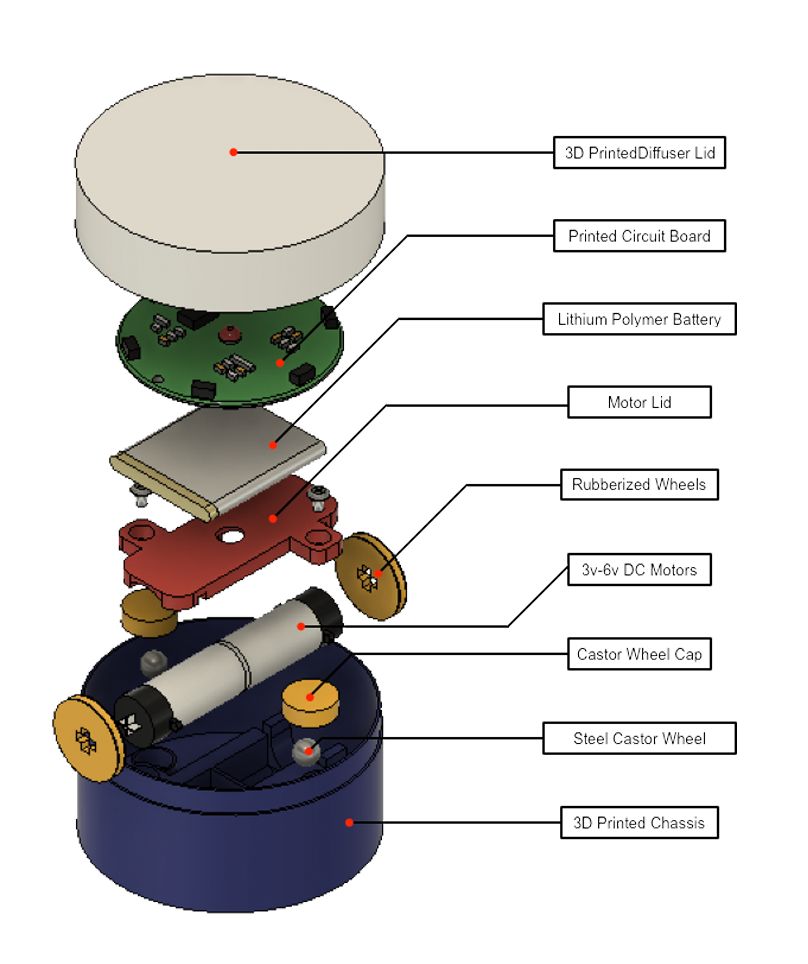
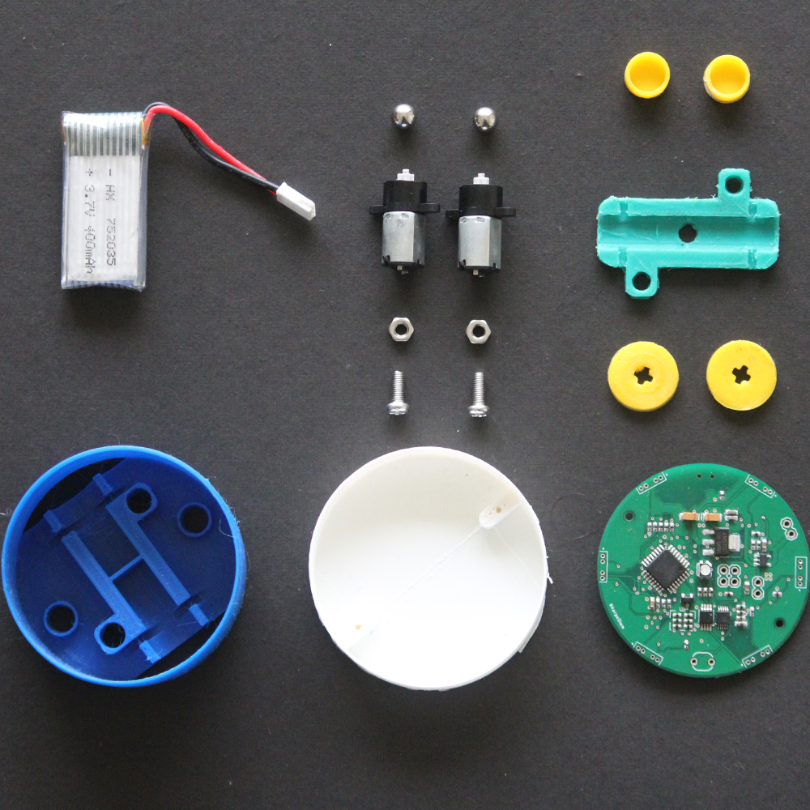
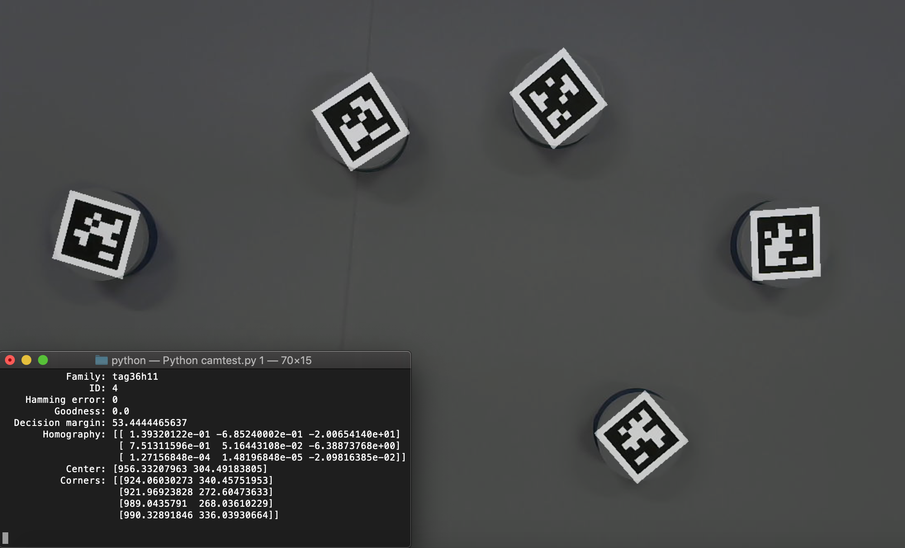

## Introduction

 | 
:-------------------------:|:-------------------------:
Robots in action on the testbed | Robots in formation control

:-------------------------:|:-------------------------:
 | 
:-------------------------:|:-------------------------:
Formation control topology | Exploded view of robot's mechanical design

 | 
:-------------------------:|:-------------------------:
Teardown of physical robot | Robot homography tracking with AprilTags
