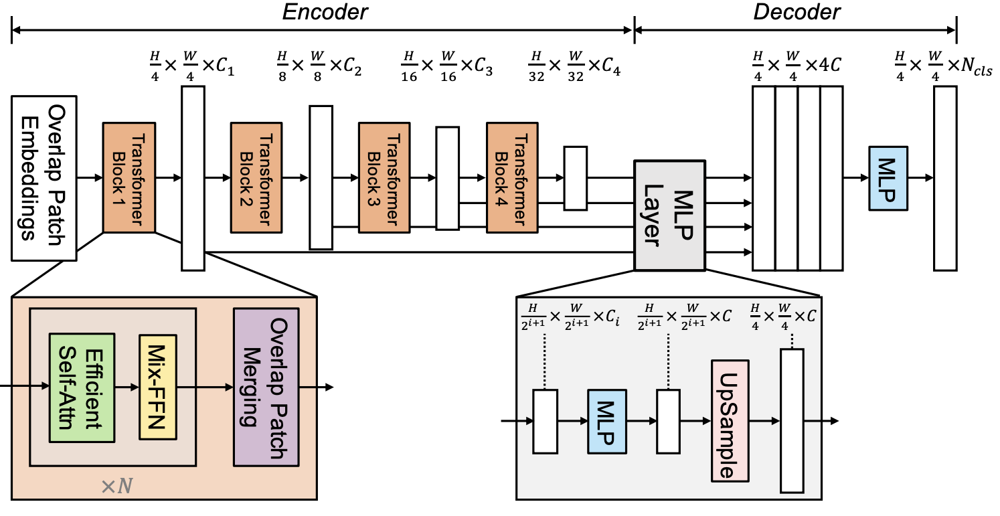

## Github Repository
[https://github.com/karpenet/Segformer](https://github.com/karpenet/Segformer)

## Building the SegFormer Model Architecture
Instead of using a pre-built model, I decided to implement the SegFormer architecture from scratch to gain a deeper understanding of its inner workings. Here’s a brief outline of the architecture:

<div style="text-align:center">
    
    <figcaption>Fig: Segformer Architecture</figcaption>
</div>

### Hierarchical Transformer Encoder
Segformer’s encoder consists of multiple transformer layers arranged in a hierarchical structure. This design allows it to capture multi-scale features from the input image, which is essential for effective segmentation.

- Stage-wise Design: The encoder is divided into several stages, where each stage processes features at different resolutions, progressively decreasing the spatial resolution and increasing the feature depth.

- Patch Embedding: Similar to Vision Transformers (ViTs), the input image is split into patches, which are linearly projected into embedding vectors. However, Segformer uses overlapping patches, which help retain more spatial information compared to non-overlapping patches in standard ViTs.
- Multi-Head Attention with Linear Complexity: Segformer uses an efficient self-attention mechanism called Efficient Self-Attention (ESA), which reduces the quadratic complexity of vanilla self-attention to linear complexity. This allows Segformer to handle high-resolution inputs efficiently.
- No Positional Encoding: Unlike ViTs, which rely on positional encoding to retain spatial structure, Segformer skips positional encoding. Instead, it leverages its hierarchical architecture to capture spatial dependencies implicitly.

### Efficient Multi-Head Self-Attention (MHSA)
Segformer modifies traditional MHSA to work efficiently at different resolutions. It avoids using computationally expensive self-attention layers throughout the network by introducing the following:

- Depthwise Separable Convolutions: This is used to increase local inductive biases and reduce the computational cost of fully connected layers. Depthwise convolutions help capture local spatial details, compensating for the limitations of transformers in capturing fine details.
- Multi-Scale Feature Extraction: Each stage of the encoder extracts features at different resolutions, allowing the model to represent both local and global contextual information efficiently.

### MLP Decoder for Segmentation
The decoder in Segformer is lightweight and minimalistic. Instead of using a complex decoder architecture, Segformer adopts a simple Multi-Layer Perceptron (MLP)-based decoder:

- Aggregation of Multi-Scale Features: The decoder takes the output features from each stage of the encoder and aggregates them to produce the final segmentation map. The MLP layers are responsible for fusing the features across different resolutions.
- Per-Pixel Segmentation: After fusing the multi-scale features, the decoder predicts class scores for each pixel to generate the segmentation map.

### Design Considerations
- Efficiency: Segformer is designed with efficiency in mind, utilizing lightweight components (such as linear attention and depthwise separable convolutions) to ensure fast inference, especially useful for high-resolution inputs.
- Flexibility: The hierarchical transformer encoder makes Segformer flexible for tasks requiring multi-scale feature extraction, which is crucial for semantic segmentation where both local and global information matter.
- No Positional Encodings: The absence of explicit positional encodings simplifies the model and allows it to generalize better to images with varied sizes and scales.

### Advantages
- State-of-the-art Performance: Segformer achieves excellent performance on popular semantic segmentation benchmarks like ADE20K and Cityscapes, while being faster and more efficient than traditional convolutional neural networks (CNNs) and earlier transformer-based models like Vision Transformers (ViTs).
- Scalability: Due to its lightweight design and linear self-attention mechanism, Segformer scales well to larger datasets and higher-resolution images without a significant computational burden.


<iframe src="https://wandb.ai/karpenet-uofpenn/Segformer-B0/reports/Segformer-B0-Training-Run--Vmlldzo5NTU4OTIw?accessToken=70zinxzi3m6f7qyktsj9zzk6rwdqdkti4xzdfu1c8c40qdx4u3bz6loq5uqsmgl9" style="border:none;height:1024px;width:100%"></iframe>

## Segformer Training Pipeline

These instructions can be used to train your own version of the Segformer.

## Setup

1. **Clone the repository:**

   ```bash
   git clone https://github.com/karpenet/Segformer
   cd Segformer
   ```

2. **Install the required packages:**

   Ensure you have `pip` installed, then run:

   ```bash
   pip install -r requirements.txt
   ```

3. **Set up Weights & Biases (wandb):**

   - Create an account on [wandb.ai](https://wandb.ai/).
   - Install the wandb CLI tool if not already installed:

     ```bash
     pip install wandb
     ```

   - Log in to wandb using your API Key:

     ```bash
     wandb login
     ```

## Training

1. **Prepare the configuration file:**

   The training configuration is stored in `train_config.yaml`. You can modify the hyperparameters such as `batch_size`, `epochs`, `learning_rate`, and model architecture (`arch`) as needed.

2. **Run the training script:**

   Execute the following command to start training:

   ```bash
   python train.py
   ```

   This will initialize a wandb run, load the dataset, and start the training process. The model's performance metrics will be logged to your wandb project.

## Code Structure

- `train.py`: Contains the main training loop and functions for logging metrics.
- `dataset.py`: Handles dataset downloading, preprocessing, and loading.
- `Segformer.py`: Defines the Segformer model architecture.
- `train_config.yaml`: Configuration file for training hyperparameters and model architecture.
