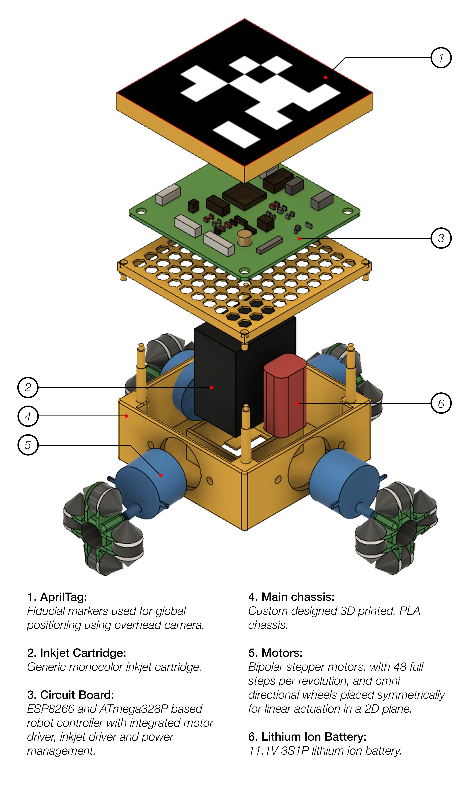

## Introduction
In this work, we consider the problem of large-format printing using a group of homogenous mobile robots. We approach this problem using an optimization method which decomposes an image into rasterized geodesic cells and allocates them to the robot team for printing.

    
    <figcaption><small>Proposed system architecture of distributed printing.</small></figcaption>

## Problem Definition
The aim is to minimize the total printing cost, which is the maximum cost amongst all robots:
$$
\text{minimize} \max (T_1, T_2, T_3, ..., T_\mathcal{N})
$$

## The Geodesic Image Cellularization Algorithm
$$
\begin{align}
\underset{\mu, W}{\text{minimize}} \quad & \sum_{m=1}^{\mathcal{M}} \sum_{n=1}^{\mathcal{N}} W_{mn}(\frac{1}{2} \|\mathrm{x}_m - \mu_n\|^{2}_{2}) \\
\textrm{subject to} \quad & \sum_{n=1}^{\mathcal{N}} W_{mn} = 1 , m = 1, ..., \mathcal{M} \\
& W_{mn} \geq 0, m = 1, ..., \mathcal{M}; n = 1, ..., \mathcal{N} \\
& \sum_{m=1}^{\mathcal{M}} W_{mn} \geq \left \lfloor \frac{\mathcal{M}}{\mathcal{N}} \right \rfloor , n = 1, ..., \mathcal{N}
\end{align}
$$

## Robot Design

    
    <figcaption><small>Exploded view of the SPRINTER robot</small></figcaption>

## Experiments

 | 
:-------------------------:|:-------------------------:
Fire test of the inkjet cartridge driver | First power-on test of the robot

## Publications
1. [Karpe, K., Chatterjee, A., Srinivas, P., Samiappan, D., Ramamoorthy, K., Sabattini, L.: Sprinter: A discrete locomotion robot for precision swarm printing. In: 2019 19th International Conference on Advanced Robotics (ICAR), pp. 733–738. IEEE (2019)](https://doi.org/10.1109/ICAR46387.2019.8981621)
2. [Karpe, K., Sinha, A., Raorane, S. Chatterjee, A., Srinivas, P., Sabattini, L.: Towards Optimized Distributed Multi-Robot Printing: An Algorithmic Approach](https://arxiv.org/abs/2102.12026)

## Codebase
1. [SPRINTER-Hardware](https://github.com/beeclust-mrsl/SPRINTER-Hardware)
2. [SPRINTER-Firmware](https://github.com/beeclust-mrsl/SPRINTER-Firmware)
3. [SPRINTER-Utilities](https://github.com/beeclust-mrsl/SPRINTER-Utilities)