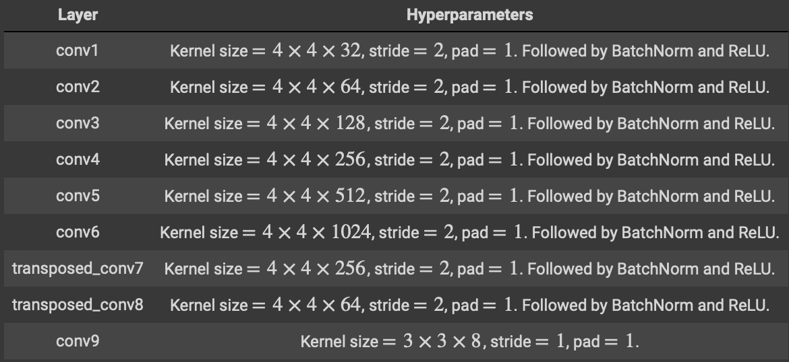
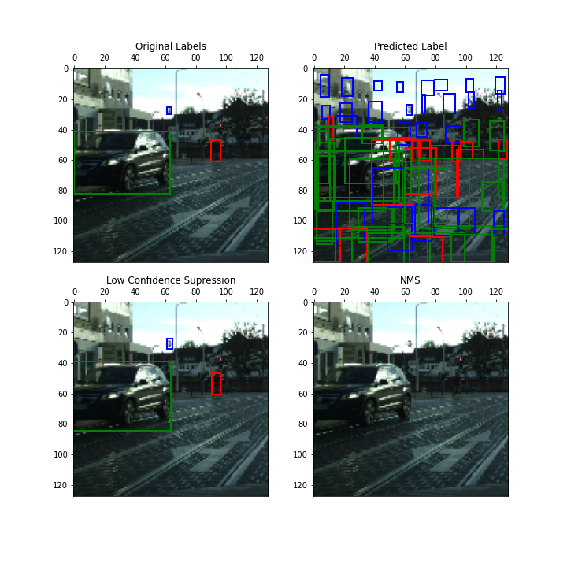

## Github Repository
[https://github.com/kedarkarpe/YouOnlyLookOnce-SmPl](https://github.com/kedarkarpe/YouOnlyLookOnce-SmPl)

## Introduction
Object detection is a fundamental task in computer vision. The problem of object recognition essentially consists of first localizing the object and then classifying it with a semantic label. In recent deep learning based methods, YOLO is an extremely fast real time multi object detection algorithm.

## Model Architecture

    
    <figcaption>Fig: YOLO model layer details</figcaption>

## Implementation

    
    <figcaption>Fig: Training pipeline for YOLO</figcaption>

## Results

    
    <figcaption>Fig: Original and Predicted bounding boxes by the model</figcaption>

## References
1. Original YOLO paper: [https://arxiv.org/pdf/1506.02640.pdf](https://arxiv.org/pdf/1506.02640.pdf)
2. Intuitive Explanation: [https://towardsdatascience.com/yolo-you-only-look-once-real-time-object-detection-explained-492dc9230006](https://towardsdatascience.com/yolo-you-only-look-once-real-time-object-detection-explained-492dc9230006)
3. YOLO Video Tutorial: [https://www.youtube.com/watch?v=9s_FpMpdYW8&list=PLkDaE6sCZn6Gl29AoE31iwdVwSG-KnDzF&index=30](https://www.youtube.com/watch?v=9s_FpMpdYW8&list=PLkDaE6sCZn6Gl29AoE31iwdVwSG-KnDzF&index=30)
4. mean Average Precision: [https://medium.com/@jonathan_hui/map-mean-average-precision-for-object-detection-45c121a31173](https://medium.com/@jonathan_hui/map-mean-average-precision-for-object-detection-45c121a31173)
5. Intersection over Union: [https://www.pyimagesearch.com/2016/11/07/intersection-over-union-iou-for-object-detection](https://www.pyimagesearch.com/2016/11/07/intersection-over-union-iou-for-object-detection)